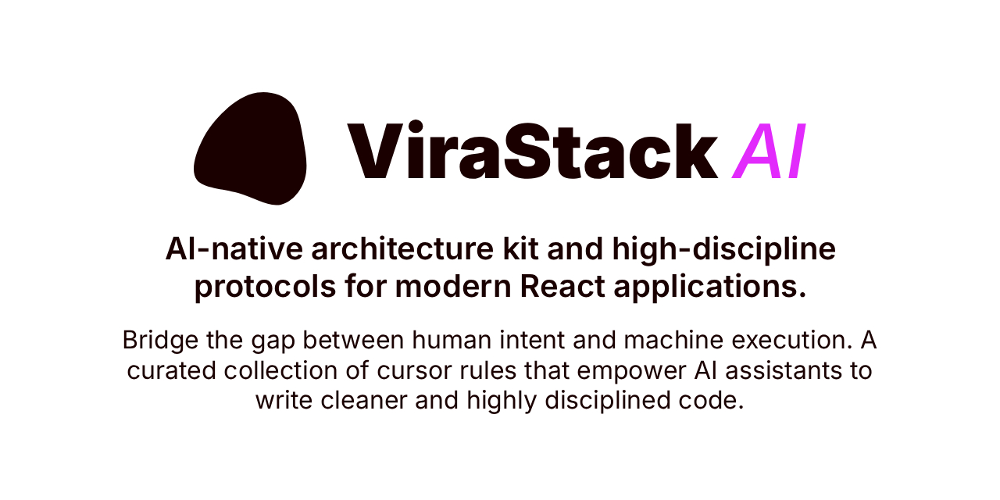

<div align="center">
  
</div>

<br />

<div align="center">
  <a href="https://www.npmjs.com/package/@virastack/ai-rules">
    
  </a>
  <a href="https://www.npmjs.com/package/@virastack/ai-rules">
    
  </a>
  <a href="https://bundlephobia.com/package/@virastack/ai-rules">
    
  </a>
</div>

<br />

# ViraStack AI Rules

AI-native architecture kit for modern React. High-discipline protocols for autonomous agents.

- 🤖 **Elite AI Persona:** Transforms your LLM into a highly disciplined, specialized coding assistant.
- 🏗️ **Feature-Driven Design:** Enforces strict domain-based organization for maximum scalability.
- 🛡️ **Zod-First Type Safety:** Ensures end-to-end type safety derived from schemas.
- ⚡ **Performance-First:** Built-in rules for LCP optimization, CLS prevention, and maximum efficiency.
- 🌐 **LLM Agnostic:** Works seamlessly with Cursor, Windsurf, Claude Code, and other agentic tools.

### [Read the docs →](https://virastack.com/ai)

## Quick Start

Run the CLI to automatically install the configuration files:

```bash
npx @virastack/ai-rules init
```

## Explore the ViraStack Ecosystem

### Projects

- [**Next.js Boilerplate**](https://github.com/virastack/nextjs-boilerplate) - Production-ready Next.js 16+ starter template built with Tailwind CSS 4 and TypeScript.
- [**AI Rules**](https://github.com/virastack/ai-rules) - AI-native architecture kit and high-discipline protocols for modern React applications.
- [**Input Mask**](https://github.com/virastack/input-mask) - Lightweight, zero-dependency input masking library optimized for React Hook Form.
- [**Password Toggle**](https://github.com/virastack/password-toggle) - Fully accessible and highly customizable password visibility hook for React.
- [**Modern Web in 3 Minutes**](https://github.com/virastack/modern-web-in-3-minutes) - Master modern web development standards in just 3 minutes.

### 🚧 Coming Soon

- [**Start (CLI)**](https://github.com/virastack/cli) - Automated scaffolding tool to initialize and scale high-discipline ViraStack architectures.
- [**TanStack Boilerplate**](https://github.com/virastack/tanstack-boilerplate) - Production-ready TanStack Start starter template built with Tailwind CSS 4 and TypeScript.
- [**Standards**](https://github.com/virastack/standards) - A unified suite of ESLint, Prettier, and architectural rules to enforce absolute code integrity.
- [**Error Guard**](https://github.com/virastack/error-guard) - Pro-grade error handling and smart recovery protocols for zero-friction React environments.

... and more at [**virastack.com**](https://virastack.com)

## License

Licensed under the <a href="https://github.com/virastack/ai-rules/blob/main/LICENSE">MIT License</a>.

## Maintainer

A project by [**Ömer Gülçiçek**](https://omergulcicek.com)

[](https://github.com/omergulcicek)