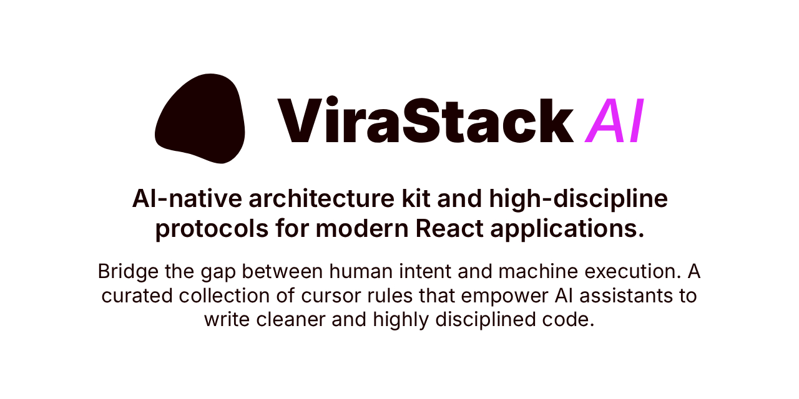

<div align="center">
  
</div>

<br />

<div align="center">
  <a href="https://www.npmjs.com/package/@virastack/ai">
    
  </a>
  <a href="https://www.npmjs.com/package/@virastack/ai">
    
  </a>
  <a href="https://bundlephobia.com/package/@virastack/ai">
    
  </a>
</div>

<br />

# ViraStack AI Rules

AI-native architecture kit for modern React. High-discipline protocols for autonomous agents.

- 🤖 **Elite AI Persona:** Transforms your LLM into a highly disciplined, specialized coding assistant.
- 🏗️ **Feature-Driven Design:** Enforces strict domain-based organization for maximum scalability.
- 🛡️ **Zod-First Type Safety:** Ensures end-to-end type safety derived from schemas.
- ⚡ **Performance-First:** Built-in rules for LCP optimization, CLS prevention, and maximum efficiency.
- 🌐 **LLM Agnostic:** Works seamlessly with Cursor, Windsurf, Claude Code, and other agentic tools.

### [Read the docs →](https://virastack.com/ai/)

## Protocol Coverage

| Protocol | Focus Areas |
| :--- | :--- |
| **UI & UX** | Atomic design, A11y SSOT, AI-Aesthetic bans, Skeleton states. |
| **API Layer** | Zod-validation, SSR Safety, Error normalization, Branded types. |
| **Performance** | Core Web Vitals targets, Bundle budgets, Image priority. |
| **State** | Zustand selectors, Hydration safety, TanStack Query integration. |
| **Frameworks** | Next.js 16 (RSC/Actions) & TanStack Start (Loaders/ServerFn). |

## Quick Start

Initialize the elite protocols in your project with a single command:

```bash
npx @virastack/ai init
```

## How it Works

1. **Install:** Run `npx @virastack/ai init`.
2. **Context:** The CLI injects specialized `.mdc` files into your `.cursor/rules` directory.
3. **Reasoning:** Agent (Cursor/Claude) automatically detects these rules based on your file activity.
4. **Execution:** Your AI assistant starts writing code according to the ViraStack High-Discipline protocols.

## Explore the ViraStack Ecosystem

Discover all ViraStack tools, libraries, and boilerplates at [**virastack.com**](https://virastack.com).

## License

Licensed under the <a href="https://github.com/virastack/ai/blob/main/LICENSE">MIT License</a>.

## Maintainer

A project by [**Ömer Gülçiçek**](https://omergulcicek.com)

[](https://github.com/omergulcicek)